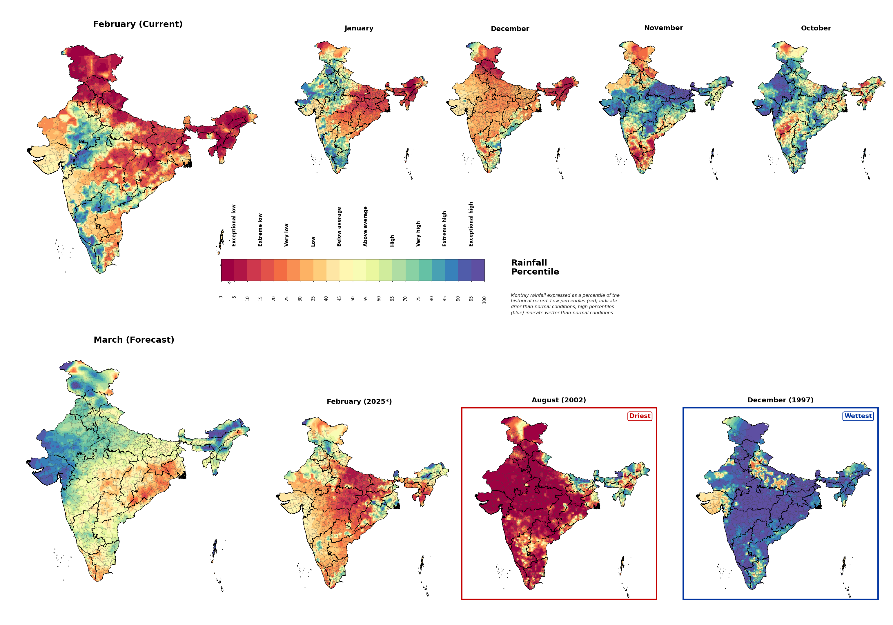

# Schema description for IHO files

### Typical columns for IHO parameter files

```
Lat long currentmonth foremonth 1prev 2prev 3prev 4prev lastyearsamemonth driest wettest
```

### More description od data

I am giving you the data of Indian hydrologic outlook for different parameters (for a particular month, in this case March).

1. Rainfall(P_2026_02_28)
2. Surface Air Temperature(T_2026_02_28)
3. Relative Wetness (sm_2026_02_28)
4. Total Runoff(ro_2026_02_28)
5. Evapotranspiration(ET_2026_02_28)



To Be Removed:

6. Streamflow at Gauge Stations(Station_Q_2026_02_28)
7. Streamflow at Stream Network(Q_2026_02_28)

The columns in each parameter files are as follows(in order)

1. Latitude
2. Longitude
3. Current Month
4. Forecast Month
5. 1st Previous Month
6. 2nd Previous Month
7. 3rd Previous Month
8. 4th Previous Month
9. Last Year Same Month
10. Lowest/ Coldest / Driest
11. Highest/ Warmest/ Wettest

### Tasks

We have the data, now generate maps corresponding to all the columns one by one for a particular parameter and then those maps get arranged in form of a dashboard as shown in attached pngs(keep the dimensions and arrangement same as shown in the attached pngs) and then the dashboard automatically gets saved in a given google drive folder. And then the same task is repeated for all the remaining parameters one after another.

This is done through the Python notebook already. We don't have to worry about this while changing the website. The files are already in the `Hydrologic_Outlook/Output/` folder.

For example, this is a dashboard generated:



You can refer to https://indiahydrolook.in/  website to have a look at the dashboards we are aimining to generate.

The first task is to display these dashboards on the website as images, similar to how it's done in https://indiahydrolook.in/

The second task is to add the PDF reports created by the Python notebook on the website (both as downloadable link and as iframe/preview)

The current PDF is `Hydrologic_Outlook/Output/PDF_Archive/Hydrolook_2026_02_28.pdf`


